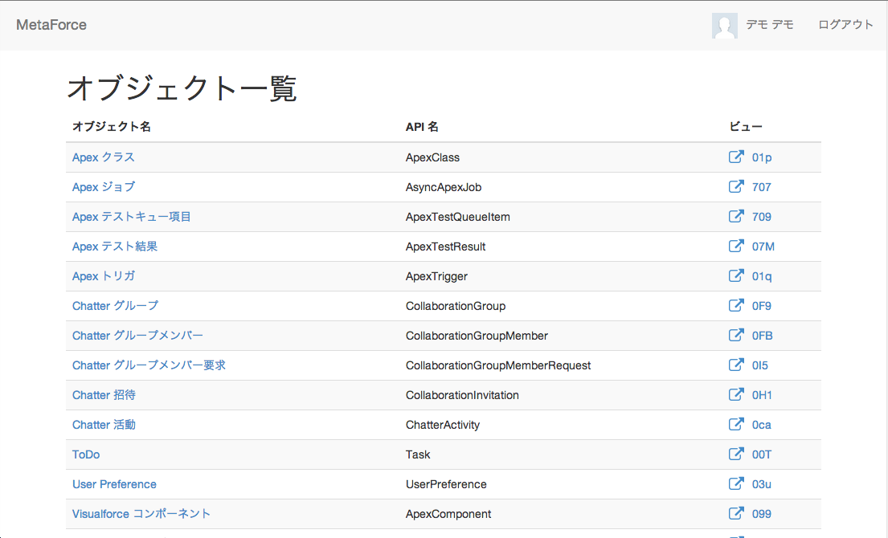
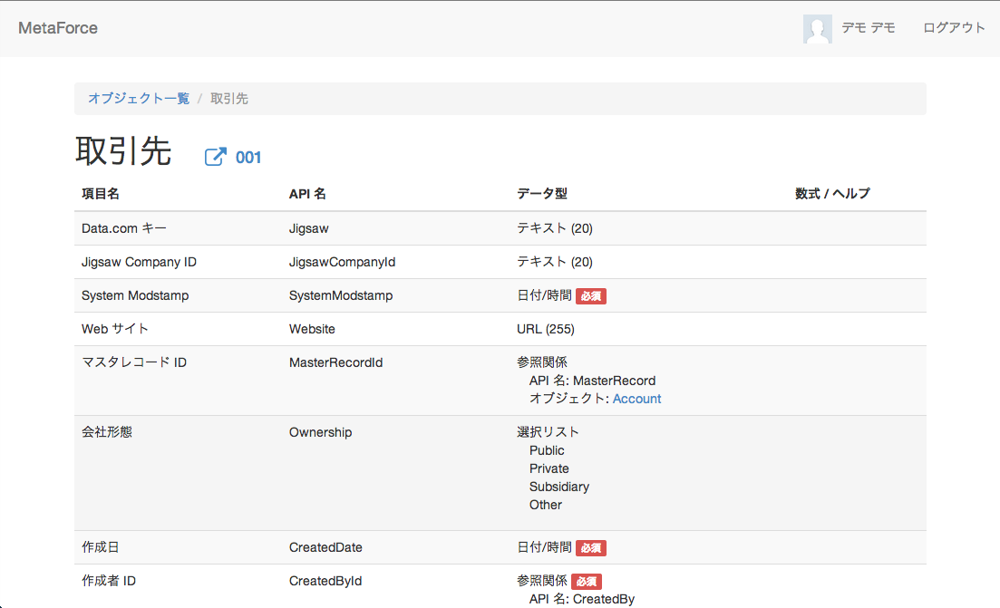

# MetaForce

salesforce.com のオブジェクト一覧、オブジェクトの項目一覧を表示する簡易 Web アプリです。

## 使い方

```
$ git clone https://github.com/taul-y/meta_force.git
$ cd meta_force
$ bundle install --path=vendor/bundle
$ vi ./config.yml
$ bundle exec rackup -p 4567
```

./config.yml には salesforce.com の接続アプリケーションの情報を入力します。

### 例

```
development:
  client_id: 'YOUR_CLIENT_KEY'
  client_secret: 'YOUR_CLIENT_SECRET'
  scope: 'id api web'
```

## デモ画面

### オブジェクト一覧画面



### オブジェクトの項目一覧画面



## TODO
* テストコード
* ビューでアクセスできないけど keyPrefix があるのでリンクが貼ってあるオブジェクトがいくつも...
